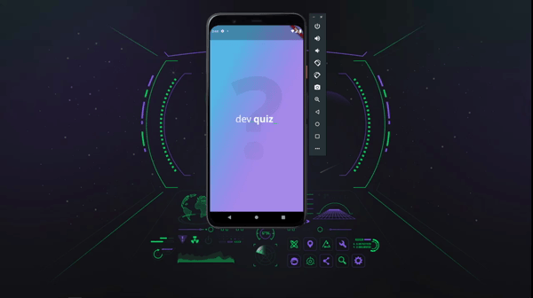

<h1 align="center">DevQuiz</h1>
<h1 align="center">
  
</h1>

## About 🚀

This project was provided by [Rocketseat](https://rocketseat.com.br/), this app was made in Flutter to learn the basic concepts about it.

---
## Techs 💻
- [Flutter](https://flutter.dev/)
- [Dart](https://dart.dev/overview)

## How to install
---
```bash 
#First make download of the project
$ git clone https://github.com/Luan4560/DevQuiz
# Access you path
$ cd DevQuiz
# Run step by step
$flutter pub get
$ flutter pub outdated
$ flutter pub upgrade

```
---

This project was build by Luan Nascimento 🤘.